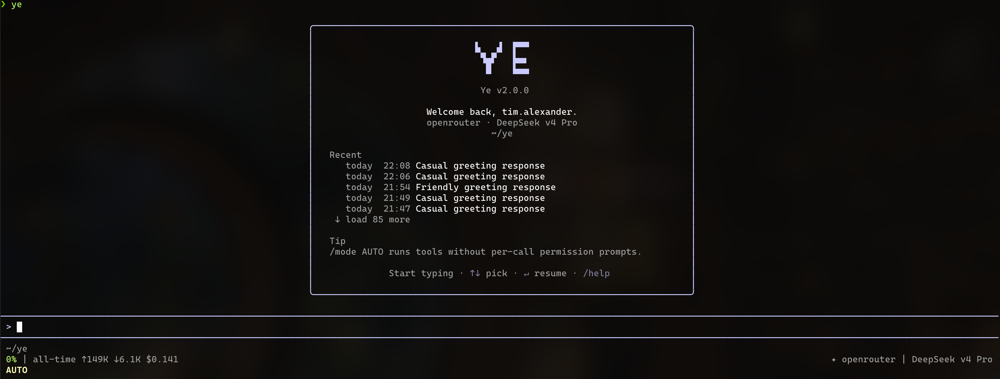
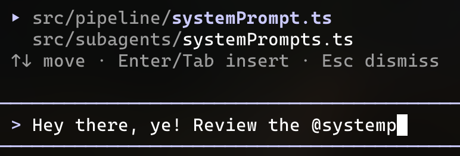
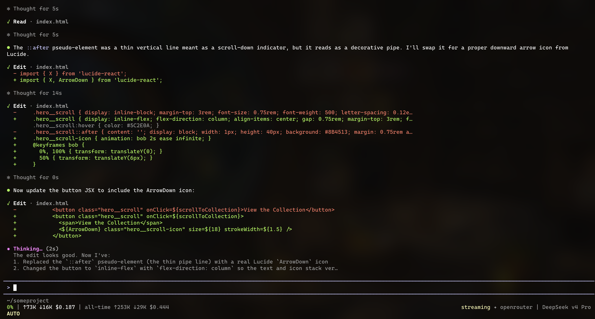
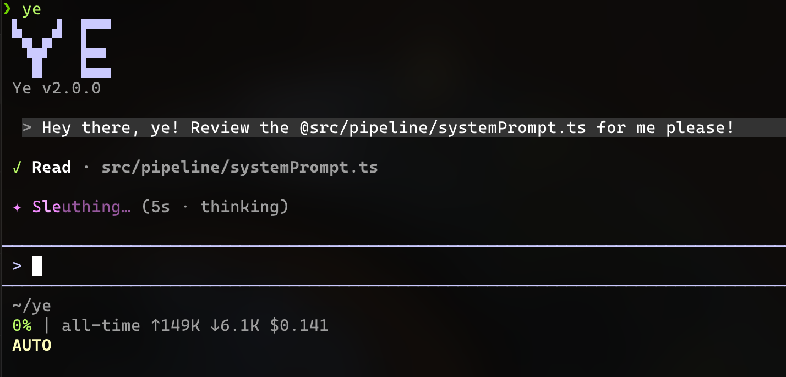

<p align="center">
  <picture>
    <source media="(prefers-color-scheme: dark)" srcset="img/ye-logo-dark.svg">
    
  </picture>
</p>

<p align="center">
  The coding agent. Open-Source, with Subagents, Planning, Web-Searches, Skills, Hooks, Great Tools, Animations, Compaction, Recoverability, and much more.
</p>

<p align="center">
  <a href="https://github.com/TimAnthonyAlexander/ye/releases"></a>
  <a href="https://bun.sh"></a>
</p>

<p align="center">
  <a href="docs/OVERVIEW.md">Documentation</a> ·
  <a href="https://github.com/TimAnthonyAlexander/ye/releases">Releases</a> ·
  <a href="docs/PIPELINE.md">Architecture</a> ·
  <a href="docs/SKILLS.md">Skills</a>
</p>

<p align="center">
  
</p>

Works with:
- OpenRouter (DeepSeek, Gemini, OpenAI, Anthropic)
- Anthropic (without OR, direct)
- OpenAI (without OR, direct)

## Install

Requires [Bun](https://bun.sh) and [ripgrep](https://github.com/BurntSushi/ripgrep).

**Prebuilt binaries** per platform — grab the latest from [GitHub Releases](https://github.com/TimAnthonyAlexander/ye/releases):

<details><summary>macOS (arm64)</summary>

```
curl -fsSL https://github.com/TimAnthonyAlexander/ye/releases/latest/download/ye-macos -o ye && chmod +x ye && sudo mv ye /usr/local/bin/ye
```

</details>
<details><summary>Linux (x64)</summary>

```
curl -fsSL https://github.com/TimAnthonyAlexander/ye/releases/latest/download/ye-linux -o ye && chmod +x ye && sudo mv ye /usr/local/bin/ye
```

</details>
<details><summary>Windows (x64, PowerShell)</summary>

```
$dest = "$env:LOCALAPPDATA\Programs\ye"; New-Item -ItemType Directory -Force $dest | Out-Null; Invoke-WebRequest https://github.com/TimAnthonyAlexander/ye/releases/latest/download/ye-windows.exe -OutFile "$dest\ye.exe"; [Environment]::SetEnvironmentVariable("Path", [Environment]::GetEnvironmentVariable("Path","User") + ";$dest", "User")
```

Restart the shell after install.
</details>

### **From source** (local dev):

```
git clone git@github.com:TimAnthonyAlexander/ye.git && cd ye
bun install
bun run build
```

## Usage

```
ye
```

Ye opens in the current directory, streams model output, prompts before state-modifying tool calls.

### In action

`@`-mention files from the project index:



Watch edits stream in as the model works:



Tool calls run with live status:



End-to-end: ask Ye to build a site, get a finished result:


**Modes** — cycle with `Shift+Tab`:

- **NORMAL** — default. State-modifying tools prompt (y/n); read-only auto-allow.
- **AUTO** — every tool auto-allows. For trusted projects and long sessions. Bash has no sandbox yet.
- **PLAN** — read-only plus `ExitPlanMode`. Model proposes a plan, you accept it, mode flips back to NORMAL. Plans persist under `~/.ye/projects/<hash>/plans/`.

Per-session override: `ye --mode AUTO` (or `NORMAL` / `PLAN`).

**CLI flags**:

- `ye --resume [sessionId]` — resume the last session (or a specific one).
- `ye --mode AUTO|NORMAL|PLAN` — start in a specific mode.
- `ye -p "<prompt>"` — headless one-shot. Streams to stdout, exits when done. No TTY needed.
- `ye --update` — self-update to the latest release binary for this platform.

**Project notes** — reads `YE.md` if present, otherwise also `CLAUDE.md` if present. 
Project memory and sessions under `~/.ye/projects/<hash>/`, keyed by a stable hash of the project root.

## Tools

Fifteen built-in tools:

| Tool | What it does |
|------|--------------|
| **Read** | Read a file (default 2000 lines, `offset` + `limit` for slicing). Absolute paths only. |
| **Edit** | Exact-string replace. Requires a prior Read of same file. `replace_all` flag. |
| **Write** | Create or overwrite. If the file exists, prior Read is required. |
| **Bash** | Run a shell command via `sh -c`. 2-min default timeout, 15-min max. |
| **Grep** | Wraps `rg`. Three modes: content, files-with-matches, count. Type/glob filters. |
| **Glob** | File pattern match, sorted by mtime. Skips noise dirs (node_modules, .git, etc.). |
| **TodoWrite** | Lightweight task list. Exactly one `in_progress` at a time. |
| **Task** | Spawn an isolated subagent (explore, general, or verification). Sidechain transcript, summary returned. |
| **WebFetch** | Fetch URL, HTML→markdown, small-model summarise. 15-min cache. Cross-host redirect detection. |
| **WebSearch** | Search the web. Anthropic server-side, Brave, or DuckDuckGo fallback. Title + URL only. |
| **Skill** | Invoke a named user/project skill for specialised instructions. Read-only metadata load. |
| **SaveMemory** | Persist a memory note. Writes to project memory store, auto-selected in future sessions. |
| **AskUserQuestion** | Ask the user a structured 2-4 option question with an optional multi-select. |
| **EnterPlanMode** | Request a switch INTO PLAN mode. Triggers a permission prompt. |
| **ExitPlanMode** | Write plan and prompt to leave PLAN mode. Only state-modifying tool allowed in PLAN. |

Read-only tools (Read, Grep, Glob, WebFetch, WebSearch, Skill, AskUserQuestion) auto-allow in NORMAL mode. Everything else prompts.

## Providers

One canonical `Provider` interface; vendor differences live behind it. Tool-call format normalization happens in the provider module — the rest of Ye never sees vendor-shaped data.

- **OpenRouter** — default. Streams via SSE, OpenAI-compatible tool calls, context window discovered via the `/models` endpoint. 
- **Anthropic direct** — native tool-use blocks, prompt caching at the static/dynamic boundary. Uses `ANTHROPIC_API_KEY`.
- **OpenAI** — latest **Responses API v1** (GPT-4.1/5 family). Interleaved reasoning & strict schema. Uses `OPENAI_API_KEY`.

Set the active provider and model in `~/.ye/config.json`. Switching providers is one config change, no other code touches it.

## Configuration

`~/.ye/config.json` controls the default provider, default model, permission rules, the auto-compact threshold (default 50% of the context window), and the env-var name to read each provider's key from. Permission rules use a small glob — `Bash(rm:*)` style — and deny always overrides allow.

## Memory & sessions

Everything Ye writes lives under `~/.ye/`:

- **Notes hierarchy** — managed (`/etc/ye/CLAUDE.md`) → user (`~/.ye/CLAUDE.md`) → project (`CLAUDE.md` or `YE.md`) → local (`YE.local.md`, gitignored). Concatenated into context in order.
- **Auto-memory** — LLM-based selection of relevant memory files at turn start. No embeddings, no vector DB. Plain Markdown, version-controllable.
- **Sessions** — append-only JSONL per session under `~/.ye/projects/<hash>/sessions/`. One event per line; replays are exact.
- **Plans** — saved as `<word>-<word>.md` for memorability.
- **Cross-session prompt history** — `~/.ye/history.jsonl`, scrollable with up-arrow.

Disk is never destructively edited. Compaction records boundary markers and patches the chain at load time; the original transcript stays intact.

## Subagents

Ye's defense against context blowup. Subagents run the same pipeline with isolated state, write their own sidechain transcript, and return a single summary string to the parent — full subagent history never enters parent context.

- **Explore** — codebase search, read-only (Read/Glob/Grep). Takes a `thoroughness` param (`quick` / `medium` / `very_thorough`).
- **General** — full toolset, runs in AUTO mode. Spawned via the Task tool with `kind: "general"`.
- **Verification** — narrow, post-change verification subagent. Used to sanity-check a finished change without polluting the main transcript.

## Skills

Skills are pre-written procedural recipes that extend Ye's behavior for specialised tasks — frontend design conventions, release workflows, language-specific patterns.
They live as markdown files under `~/.ye/skills/` (per-user) or `.ye/skills/` (per-project, committed to git).
Ye ships with built-in skills and consumes externally-authored ones from GitHub marketplaces.
Installing a skill copies its SKILL.md and supporting files into the skills directory; a restart loads it into the registry.

You can ask Ye to find a skill online and to install it. Or also to create one from your preferences or descriptions.

---

Ye is under active development. The last 50 commits were done with Ye itself.
